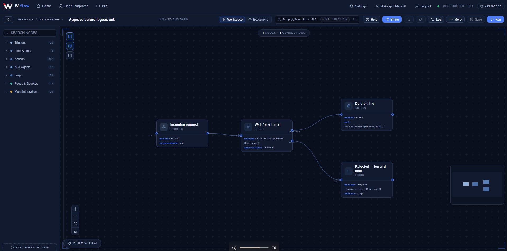

# W flow — workflow automation & AI agent builder

**Try it free:** https://w-flow.tech (open beta)

W flow is a visual workflow builder, similar to n8n, Zapier or Make.
Connect triggers, actions, logic and AI nodes on a canvas and automate
anything — in the hosted cloud workspace or on your own server.

## Features
- **400+ integrations** — Gmail, Google Sheets & Drive, Slack, Telegram,
  Discord, GitHub, Notion, Airtable, Stripe, HubSpot, databases, RSS and more
- **AI agents** — bring your own model: OpenAI, Anthropic, Gemini or a local model
- **One-click sign-in** for Google and Microsoft — no passwords or tokens to paste
- **Triggers** — webhooks, schedules (cron), chat, forms, RSS, Telegram
- **Inspect every run** — input, output and errors per node
- **Cloud or self-hosted** — your own database and encryption key

## Get started
1. Open https://w-flow.tech and create a free account
2. Start from a template or an empty workflow
3. Press **Run**

## Feedback
W flow is in beta — found a bug or have an idea? Open an
[issue](../../issues) or use the contact form on the website.
